# precision (hard)

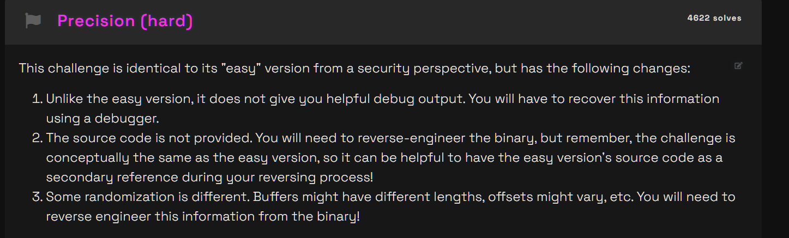

no idea what this means whatsoever lets just continue with it anyway

```bash
hacker@module-9-challenges~precision-hard:~$ cd /challenge
hacker@module-9-challenges~precision-hard:/challenge$ file binary-exploitation-lose-variable
binary-exploitation-lose-variable: setuid ELF 64-bit LSB executable, x86-64, version 1 (SYSV), dynamically linked, interpreter /lib64/ld-linux-x86-64.so.2, BuildID[sha1]=a7608af9b9c404d6598e6958885aaba7934bc4c3, for GNU/Linux 3.2.0, not stripped
```

alright alright seems chill, this should be a normal BOF attack

lets open gdb and start debugging shall we


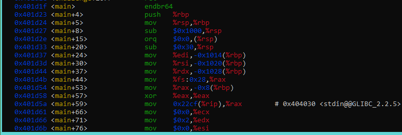

we got main at 0x401d1f, lets breakpoint that

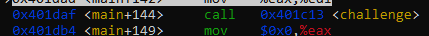

challenge is being called within main, lets breakpoint that too

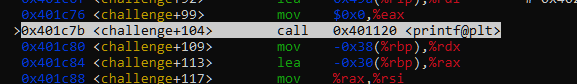

this is the part where printf is called so it's going to ask us for an input, good place to be

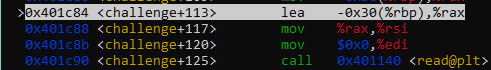

and then it's reading what our input buffer, lets try to see where that's going


this is the if statement that's going to decide whether we stay in the challenge function or not

oh also i sent a payload of roughly 8 bytes of 'a'


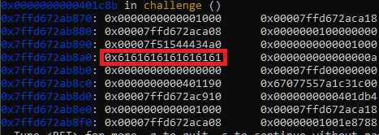

thats our payload now, we know where it is roughly in the stack 

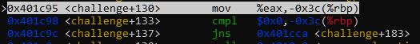

what this means?

- mov something eax from 60 bytes ahead of rbp
- comparing something at 0x0 and from that in eax

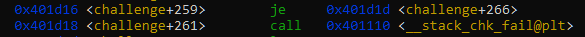

stack canary - checks if ur not randomly bufferoverflowing in hopes of the flag


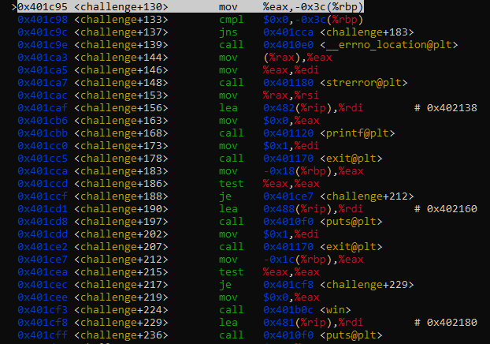


what this means in full entirety (the function we want to get to call is win)

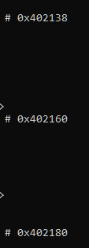

if we do x/20s 0x402138 and quickly get all the strings

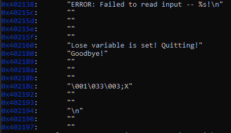

it shows a bunch of these strings which means that we're being checked against a lot of conditions

- so im assuming we need to BOF the Lose variable without crashing into other variables with precision

- hence the name of the challenge im so smart

- it's checking for input length of what we put in, if we have 0 as the input length then we get to skip past the safeguard into the win function

immediately its obvious that cmp-ing the "lose" variable which is inaccessible to our input so we're going to have to BOF this position

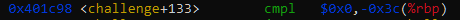

but the thing is that was actually referring to a variable that we CANNOT buffer overflow at all since its behind us from our overflowing starting direction


this is the only other hting thats altering the flow of jmp, test basically tests if eax = 0 or not

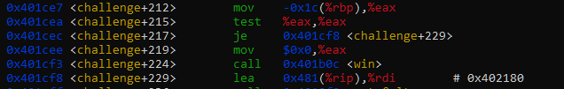

that means that basically our input which is given at rbp - 0x1c, is not supposed to be 0 otherwise skip past win

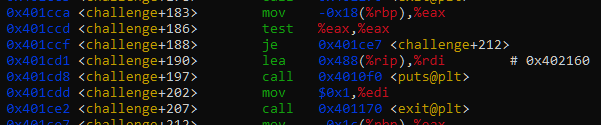

before this was another condition

that checks whether rbp - 0x18 (24) is 0 or not, now maybe we can reach that one


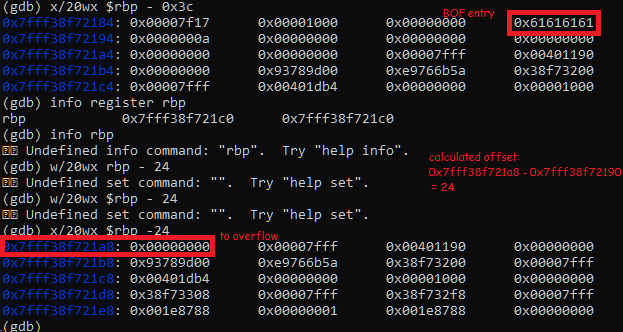

yep we can, lets test out our BOF now


whoops it doesnt work, actually what happened is this

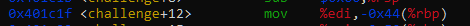


alright alright whats our 2 conditions technically speaking?


- rbp - 0x1c needs to be non zero
- rbp - 0x18 is supposed to be zero


which means we need to buffoverflow by only 24 characters EXACTLY 

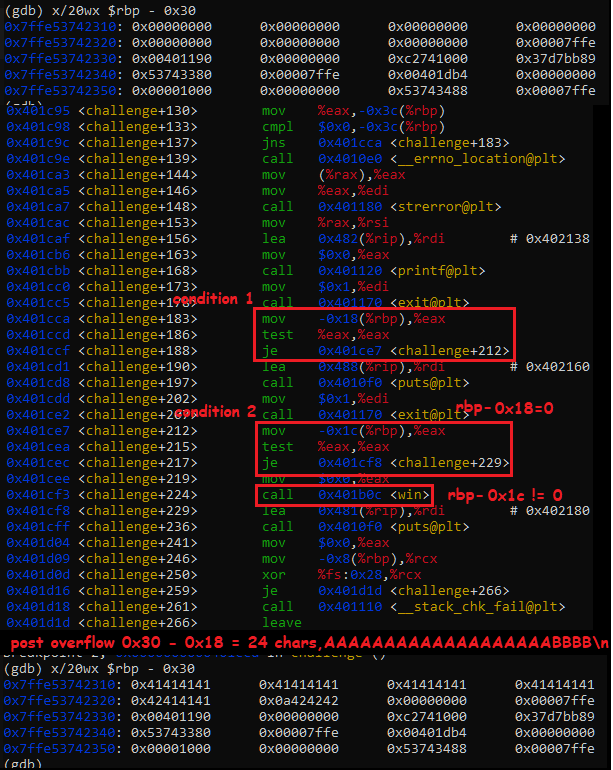

best explanation i can put out right now

ignore the comic sans

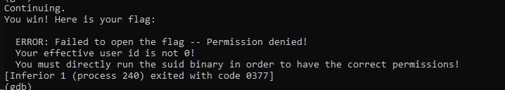

```bash
hacker@binary-exploitation~precision-hard:/challenge$ ./binary-exploitation-lose-variable
Send your payload (up to 4096 bytes)!
AAAAAAAAAAAAAAAAAAABBBB
You win! Here is your flag:
pwn.college{wV20TArFY9CK-XTvwOFckfJVe7_.0VNwcDMxwSO2EzNwIzW}
```

