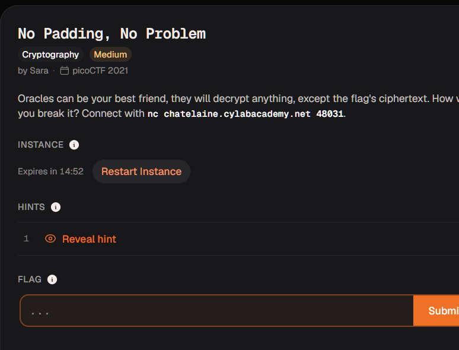
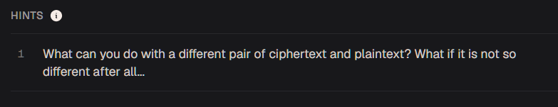
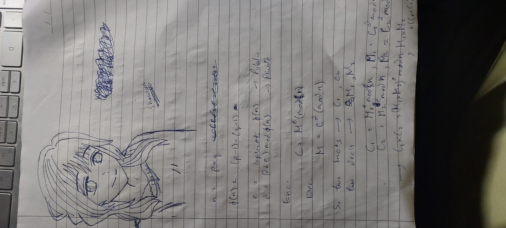
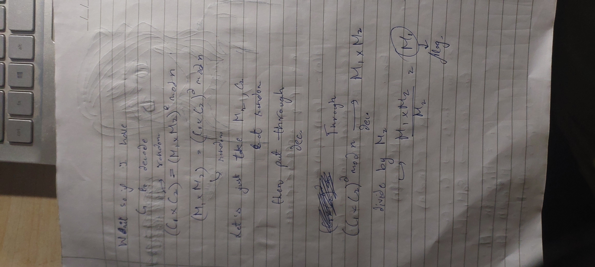

# no padding no problem



alright so time to netcat to the address


```

This oracle will take anything you give it and decrypt using RSA. It will not accept the ciphertext with the secret message... Good Luck!


n: 100209785859920132942672228317000912879672767435054576986259682194187669334936843097237081215218633654863481548978407548327657895779082124110154971110837511740404840897508269362365135146563222859279532456611376173762355620643157149602074997239679364622074535421480868654962787454982220032206641143366818913637
e: 65537
ciphertext: 62201734411346239966761954065286511018135630765086098261453700532796652456949663786820405670002032852662148184004039647169644355154903479545662219595371778658283214574036884617467150310955826849724977285572330508993933807266664842052738631630960569563223759919719899928794114698155431194235198687019308835444

Give me ciphertext to decrypt: 

```

So like the dumbass i am i tried entering the cipher text

```
Give me ciphertext to decrypt: 55003159815543039399805535208954643773428019000834964025622636662757858625932329932810585691130939808558823778353626109313979647024028626951431656953750879727499324392287985197657568611979805824831894192508041538534654666679296271568989116467883269163550110531234565683032751835375999874346834139690777821348
Will not decrypt the ciphertext. Try Again
Give me ciphertext to decrypt:

```

thats fucking funny im sorry its 12 am and i have 0 reason to hold back lmfao what the fuck is this



thats right what can you do with a different pair of ciphertext and plaintext?


so i pulled out my junk notepad


i was like cant be that hard to figure out an exploit in textbook RSA right? this is just maths im great at maths im horrible i got 10 in ioqm out of a 100


So basically







so i took C2 as 'a' then i multipled the encrypted 'a' using the public key then i divided the given decrypted part from the netcat shell by 97

the flag is - academy{m4yb3_Th0se_m3s54g3s_4r3_difurrent_86a6d735}

pretty engaging ngl i didnt expect that

i had to look up rsa concepts a little more carefully as i had forgotten so


