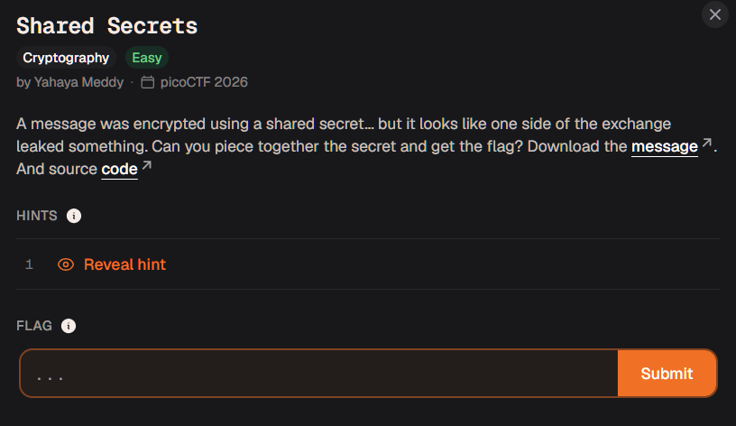

# shared secrets

level seems ez



```py
import os
import sys

from Crypto.Util.number import getPrime
from random import randint

# Public parameters
g = 2
p = getPrime(1048)

# Server's secret
a = randint(2, p-2)
A = pow(g, a, p)

# Client secret
b = randint(2, p-2)

B = pow(g, b, p)

# Shared key
shared = pow(A, b, p)

# Encrypt flag
flag = b"academy{...}"
enc = bytes([x ^ (shared % 256) for x in flag])

# Write challenge info
#
# You were handed message.txt alongside this script, and this writes that same
# name. Running it here would overwrite the file you have to solve with a fresh
# transcript over the redacted flag above -- a different p and b, and nothing to
# recover. So refuse rather than clobber.
if os.path.exists("message.txt"):
    sys.exit("message.txt already exists here -- that is the file you were given, "
             "and running this would overwrite it. Move it aside first, or run "
             "this somewhere else.")

with open("message.txt", "w") as f:
    f.write(f"g = {g}\n")
    f.write(f"p = {p}\n")
    f.write(f"A = {A}\n")
    f.write(f"b = {b}\n")
    f.write(f"enc = {enc.hex()}\n")
```


```
g = 2
p = 1755098449935463534552303044566362383005433870659059935742181814158425543435179114212479743982030167684040361028549400827555558471857829463981868754788360394827484399850825451964171648538416363117894659173425868365577216845076840360103915829103188439552600173952858962799848334394185424758884300356296328706756507539
A = 579391424982259688264913678563979735288443125097604805738952465073726965651290757904380431327355871130469899421313650748954243086461221509352825641529931237163863887805698842683152965841371986600127810674106582194462283535791275345988152604828172367827703307483965378717036750792391530743963784912003981396216153863
b = 275894578233243176556960878115300128798001428782282382010415276086698879503601991301136464548760411219903647494008680478801790954806546669846611167442778157482964600583312474696687585051390545023381681109120701844378816856887456749848534712786713456877515275961016773721871008634700028266424347552396850400741585233
enc = d2d0d2d7d6decac8d7dbecc080d0c180c7ec81d583d682d185d0ce
```

extremely simple, some constants are decided before encryption and then they have to be reversed

im tempted to explain the concept of RSA but this is doable with basic knowledge of coding aswell so im not going to

```py

import os
import sys

from Crypto.Util.number import getPrime
from random import randint

# Public parameters
g = 2
p = 1755098449935463534552303044566362383005433870659059935742181814158425543435179114212479743982030167684040361028549400827555558471857829463981868754788360394827484399850825451964171648538416363117894659173425868365577216845076840360103915829103188439552600173952858962799848334394185424758884300356296328706756507539


# Server's secret
a = randint(2, p-2)
A = 579391424982259688264913678563979735288443125097604805738952465073726965651290757904380431327355871130469899421313650748954243086461221509352825641529931237163863887805698842683152965841371986600127810674106582194462283535791275345988152604828172367827703307483965378717036750792391530743963784912003981396216153863


# Client secret
b = 275894578233243176556960878115300128798001428782282382010415276086698879503601991301136464548760411219903647494008680478801790954806546669846611167442778157482964600583312474696687585051390545023381681109120701844378816856887456749848534712786713456877515275961016773721871008634700028266424347552396850400741585233

B = pow(g, b, p)

# Shared key
shared = pow(A, b, p)
"""
# Encrypt flag
flag = b"academy{...}"
enc = bytes([x ^ (shared % 256) for x in flag])
"""

# lets take this step by step

enc = "d2d0d2d7d6decac8d7dbecc080d0c180c7ec81d583d682d185d0ce"


# shitty 0 fucks way of converting to bytearray
array = [int(enc[x]+enc[x+1],base=16) for x in range(0,len(enc)-2,2)]

# use a ^ b = c then b ^ c = a (extremely well known)

array_new = [ x ^ (shared % 256) for x in array ]

for i in array_new:
    print(chr(i),end="")

# output : academy{dh_s3cr3t_2f0e1b6c

```

BRO I WASNT EVEN TRYING?? 

apparently you only require the shared secret and rest all the constants are provided so i guess theres nothing to be done here
