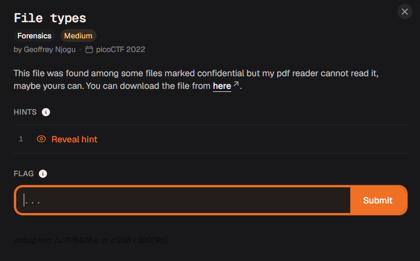
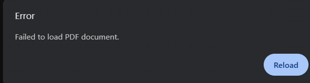
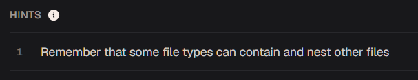
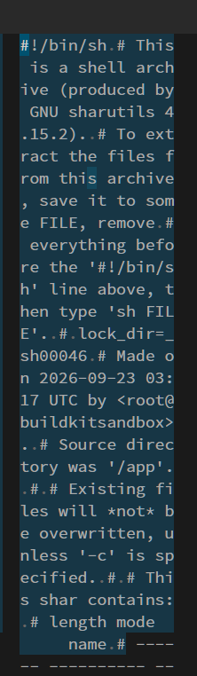
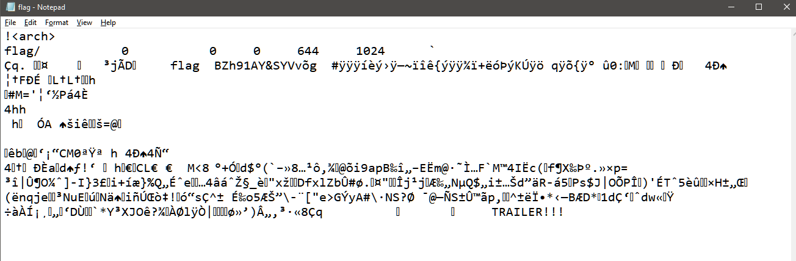
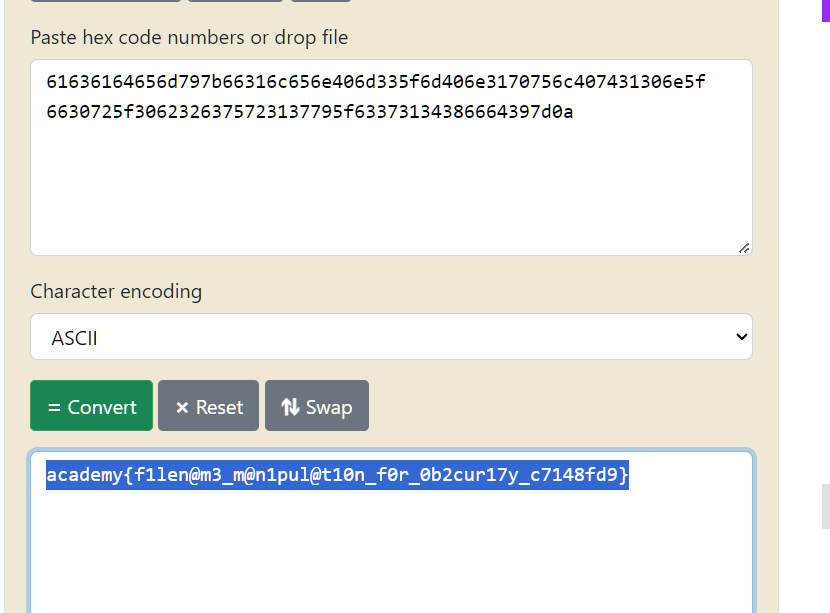

# file types





pdf document fails to load which happens to be the flag


hint says:




aight so theres some files nested in there is basically it, its basically how a pdf stores images and other weird data (i once saw javascript code in there) that is renderable.




whoops thats interesting that doesnt look like a pdf file at all

theres no magic bytes or anything, infact its more of a... shell file because of the shebang given

im smart dont test me

i changed the format to .sh

```bash

shaurya_pratap@cheeese:Downloads$ ./Flag.sh
x - created lock directory _sh00046.
x - extracting flag (text)
./Flag.sh: 119: uudecode: not found
restore of flag failed
flag: MD5 check failed
x - removed lock directory _sh00046.

```

interesting..


```sh

#!/bin/sh
# This is a shell archive (produced by GNU sharutils 4.15.2).
# To extract the files from this archive, save it to some FILE, remove
# everything before the '#!/bin/sh' line above, then type 'sh FILE'.
#
lock_dir=_sh00046
# Made on 2026-09-23 03:17 UTC by <root@buildkitsandbox>.
# Source directory was '/app'.
#
# Existing files will *not* be overwritten, unless '-c' is specified.
#
# This shar contains:
# length mode       name
# ------ ---------- ------------------------------------------
#   1092 -rw-r--r-- flag
#
MD5SUM=${MD5SUM-md5sum}
f=`${MD5SUM} --version | egrep '^md5sum .*(core|text)utils'`
test -n "${f}" && md5check=true || md5check=false
${md5check} || \
  echo 'Note: not verifying md5sums.  Consider installing GNU coreutils.'
if test "X$1" = "X-c"
then keep_file=''
else keep_file=true
fi
echo=echo
save_IFS="${IFS}"
IFS="${IFS}:"
gettext_dir=
locale_dir=
set_echo=false

for dir in $PATH
do
  if test -f $dir/gettext \
     && ($dir/gettext --version >/dev/null 2>&1)
  then
    case `$dir/gettext --version 2>&1 | sed 1q` in
      *GNU*) gettext_dir=$dir
      set_echo=true
      break ;;
    esac
  fi
done

if ${set_echo}
then
  set_echo=false
  for dir in $PATH
  do
    if test -f $dir/shar \
       && ($dir/shar --print-text-domain-dir >/dev/null 2>&1)
    then
      locale_dir=`$dir/shar --print-text-domain-dir`
      set_echo=true
      break
    fi
  done

  if ${set_echo}
  then
    TEXTDOMAINDIR=$locale_dir
    export TEXTDOMAINDIR
    TEXTDOMAIN=sharutils
    export TEXTDOMAIN
    echo="$gettext_dir/gettext -s"
  fi
fi
IFS="$save_IFS"
if (echo "testing\c"; echo 1,2,3) | grep c >/dev/null
then if (echo -n test; echo 1,2,3) | grep n >/dev/null
     then shar_n= shar_c='
'
     else shar_n=-n shar_c= ; fi
else shar_n= shar_c='\c' ; fi
f=shar-touch.$$
st1=200112312359.59
st2=123123592001.59
st2tr=123123592001.5 # old SysV 14-char limit
st3=1231235901

if   touch -am -t ${st1} ${f} >/dev/null 2>&1 && \
     test ! -f ${st1} && test -f ${f}; then
  shar_touch='touch -am -t $1$2$3$4$5$6.$7 "$8"'

elif touch -am ${st2} ${f} >/dev/null 2>&1 && \
     test ! -f ${st2} && test ! -f ${st2tr} && test -f ${f}; then
  shar_touch='touch -am $3$4$5$6$1$2.$7 "$8"'

elif touch -am ${st3} ${f} >/dev/null 2>&1 && \
     test ! -f ${st3} && test -f ${f}; then
  shar_touch='touch -am $3$4$5$6$2 "$8"'

else
  shar_touch=:
  echo
  ${echo} 'WARNING: not restoring timestamps.  Consider getting and
installing GNU '\''touch'\'', distributed in GNU coreutils...'
  echo
fi
rm -f ${st1} ${st2} ${st2tr} ${st3} ${f}
#
if test ! -d ${lock_dir} ; then :
else ${echo} "lock directory ${lock_dir} exists"
     exit 1
fi
if mkdir ${lock_dir}
then ${echo} "x - created lock directory ${lock_dir}."
else ${echo} "x - failed to create lock directory ${lock_dir}."
     exit 1
fi
# ============= flag ==============
if test -n "${keep_file}" && test -f 'flag'
then
${echo} "x - SKIPPING flag (file already exists)"

else
${echo} "x - extracting flag (text)"
  sed 's/^X//' << 'SHAR_EOF' | uudecode &&
begin 600 flag
M(3QA<F-H/@IF;&%G+R`@("`@("`@("`@,"`@("`@("`@("`@,"`@("`@,"`@
M("`@-C0T("`@("`Q,#(T("`@("`@8`K'<2X`&`:D@0`````!````LVK#1`4`
M`````F9L86<``$)::#DQ05DF4UE6=O5G```C____[>C]F_^7?N_NZGO]__^^
M[ROK\][]2]K_]@!Q__5[_[``^S`Z`TT:``:-`!H`T`&@```TT`R!IH9&@9#0
MR:`#3(9,AHT::`T&(TT])Z:1O5#A-,@--&AH#0!H&0``TT&@#)IIZ@,:FCU`
M&AZ@#0``#0'J8AA``9&ADT--,*J?J@!H`#30#(&0--&3":`--`:&$`#0R&$:
M9`R#(9&@`:!H!H`#0TR``(`@`$T\.`*P*],:9"2P*&"6NSB%N?0LOA1`]6DY
M87!"B>Z$ED7+;4"WF,R%1I!@39DT2<MC*!9FMEB)WKHNN]=P/0VS[GS;MD^\
MB%VM27TSHQEI*^WF?9`E483)B&6!!X4TXN&(CJ=?Z`4B>)Z0&T1F>)!L6F+;
M(_@N#J0B&`C.:KEJ",:)A$ZU422$:;&%BF24Y%*MX34%4',D2GQ/U5#.`2DG
MR52(->C[%8'72+&$C!8HZQ]N<6IE`Q"S3G5%#OH63N0,&6GQVHSRAR$3\Y-S
MQUZQ`,F);S7&BI1<K:A;(F4^1]UY02-<MTY3/]B@KT"7T5.!L=N9XW`L`PA>
ML>O/E2J+ET+&1)`J?S%D'L>1&XAD=ZL7GPKWX,#-H;@6A`:11-D."&`J6;-8
M2D_J/[X$P-AL_])\!I`.!_B[DBG"A(*SMZLXQW$``````````````0``````
M```+``````!44D%)3$52(2$A````````````````````````````````````
M````````````````````````````````````````````````````````````
M````````````````````````````````````````````````````````````
M````````````````````````````````````````````````````````````
M````````````````````````````````````````````````````````````
M````````````````````````````````````````````````````````````
M````````````````````````````````````````````````````````````
M````````````````````````````````````````````````````````````
M````````````````````````````````````````````````````````````
M````````````````````````````````````````````````````````````
,````````````````
`
end
SHAR_EOF
  (set 20 26 09 23 03 17 23 'flag'
   eval "${shar_touch}") && \
  chmod 0644 'flag'
if test $? -ne 0
then ${echo} "restore of flag failed"
fi
  if ${md5check}
  then (
       ${MD5SUM} -c >/dev/null 2>&1 || ${echo} 'flag': 'MD5 check failed'
       ) << \SHAR_EOF
85c61ce6268bd11acbd24a656eb28c85  flag
SHAR_EOF

else
test `LC_ALL=C wc -c < 'flag'` -ne 1092 && \
  ${echo} "restoration warning:  size of 'flag' is not 1092"
  fi
fi
if rm -fr ${lock_dir}
then ${echo} "x - removed lock directory ${lock_dir}."
else ${echo} "x - failed to remove lock directory ${lock_dir}."
     exit 1
fi
exit 0

```


number 1 thing i did i sudo apt installed sharutils to get uudecode and it immediately generated something

```bash
shaurya_pratap@cheeese:Downloads$ ./Flag.sh
x - created lock directory _sh00046.
x - extracting flag (text)
x - removed lock directory _sh00046.

```

ok so its extracting the flag BUT THEN ITS IMMEDIATELY REMOVING IT thats bad we need to erase that part of the script

alright now flag file look like this




quick google search yields 

The text sequence !<arch> followed by a newline is the magic bytes signature for an ar (archive) file, commonly known as the UNIX archiver format

turns out its a .deb extension file which if you dig further

another flag file hidden underneath layers of other extractables, its lzip this time so ive hit a wall


inside is compressed lz4 file

inside is lzma file

then lzop then lzip to 7z

inside is hex




i wouldve ended myself if i had to open another 10 compressed files underneath just let me get flag please and let me go

