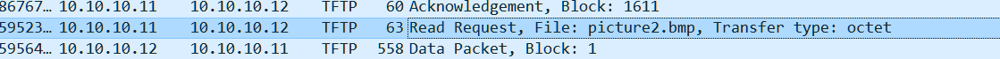
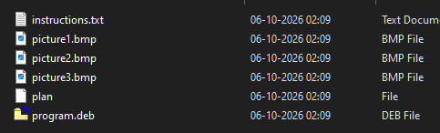

# Trivial Flag Protocol

so ima open this one in wireshark

i remember one of my favourite ctfs was where they hooked up wireshark packet sniffing to mouse inputs and then gave it so people had to draw the flag


observations

- all of this is in a protocol known as TFTP - thats probably the problem's title name so not much to go off
- most interesting observation



we are reading a .bmp image too

- the sender is sending the file's bytes, reciever is acknowledging the blocks in which they come in 


- so far we're reading both a program.deb and a picture1.bmp, and a picture2.bmp, picture3.bmp

- transfer type for every file is octet


post decoding nightmare which i wont go into, you use struct.unpack with !H mode, get the data coming in chunks and then write them to files separately, in python using pyshark. worst piece of code ive ever written





putting instructions.txt through caesar
GSGCQBRFAGRAPELCGBHEGENSSVPFBJRZHFGQVFTHVFRBHESYNTGENAFSRE.SVTHERBHGNJNLGBUVQRGURSYNTNAQVJVYYPURPXONPXSBEGURCYNA

is

TFTPDOESNTENCRYPTOURTRAFFICSOWEMUSTDISGUISEOURFLAGTRANSFER.FIGUREOUTAWAYTOHIDETHEFLAGANDIWILLCHECKBACKFORTHEPLAN

simply put: i dont care what this means im just gonna bruteforce through raw skill and get the answer anyway

the plan file

IUSEDTHEPROGRAMANDHIDITWITH-DUEDILIGENCE.CHECKOUTTHEPHOTOS

duediligence is the pw they used. good to know.


nice photos btw

```bash
shaurya_pratap@cheeese:out$ steghide extract -sf picture1.bmp -p DUEDILIGENCE
steghide: could not extract any data with that passphrase!
shaurya_pratap@cheeese:out$ steghide extract -sf picture2.bmp -p DUEDILIGENCE
steghide: could not extract any data with that passphrase!
shaurya_pratap@cheeese:out$ steghide extract -sf picture3.bmp -p DUEDILIGENCE
wrote extracted data to "flag.txt"
```


they gave the program.deb but i didnt use it i just apt installed steghide like im supposed to instead of trusting an old ass copy of steghide


academy{h1dd3n_1n_pLa1n_51GHT_18375919}

