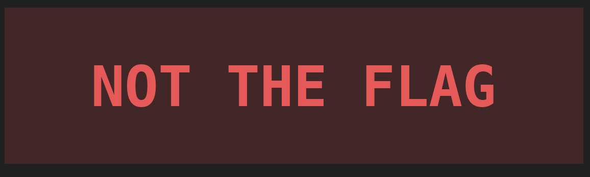
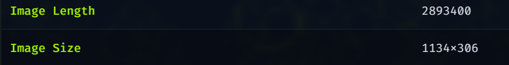
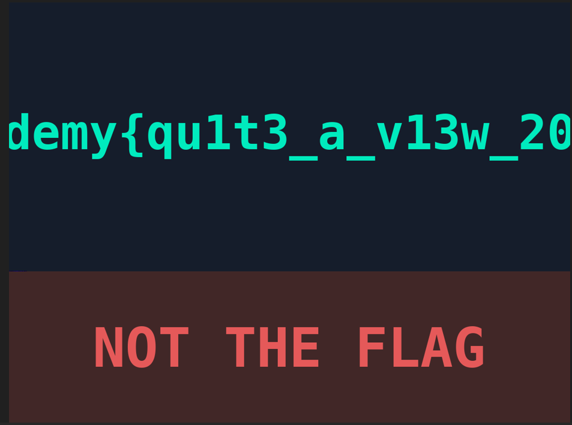

# tunn3l v1s10n 

now this one is kinda interesting, the file given obviously starts with "BM" so its supposed to be a .BMP image

but its broken and it wont display so we'll have to fix it ourselves, the hint says its clearly not opening so yeah.

so most probably this is a header fixing problem

so ill use a hex editor and fix it right up

so the general idea of a bmp file looks like is 

42 4D XX XX XX XX 00 00 00 00 36 00 00 00 28 00 
00 00 WW WW WW WW HH HH HH HH 01 00 18 00 00 00 
00 00 SS SS SS SS 13 0B 00 00 13 0B 00 00 00 00 
00 00 00 00 00 00

1. 42 4D (Magic Bytes): Keeps the valid "BM" signature.
2. XX XX XX XX (Total File Size): The complete size of the .bmp file in bytes.
3. 00 00 00 00 (Reserved): Always zero.
4. 36 00 00 00 (Pixel Offset)
5. 28 00 00 00 (DIB Header Size): Sets the DIB header size to exactly 40 bytes (BITMAPINFOHEADER).
6. WW WW WW WW (Width): The width of the image in pixels.
7. HH HH HH HH (Height): The height of the image in pixels.
8. 01 00 (Planes): Always 1.
9. 18 00 (Bit Depth): Sets it to 24-bit color (already correct in your original dump).
10. 00 00 00 00 (Compression): 0 for uncompressed BI_RGB.
11. SS SS SS SS (Raw Pixel Image Size): The size of just the pixel data area (Total File Size minus 54).
12. 13 0B 00 00 13 0B 00 00 (Resolution): Standard print resolution markers (can safely be left as 00s if unknown).
13. Remaining 00s: Palette fields, left at zero for 24-bit true color.

now a massive problem is - i dont fucking know what the width and height is supposed to be.

this matters because the offset and chunk sizing is decided by width and height themselves so why am i explaining this you know this.

unsigned char ucDataBlock[54] = {
	// Offset 0x00000000 to 0x00000035
	0x42, 0x4D, magic bytes
  0x8E, 0x26, 0x2C, 0x00, total file size
  0x00, 0x00, 0x00, 0x00, reserved
  0xBA, 0xD0, 0x00, 0x00, this is wrong should be definitely 36 00 00 00 
  0xBA, 0xD0, 0x00, 0x00, DIB header size this is also wrong this is 28 00 00 00
  0x6E, 0x04, 0x00, 0x00, width - 1134 (little endian)
  0x32, 0x01, 0x00, 0x00, height - 306
  0x01, 0x00,                    - good
  0x18, 0x00,                    - good (this is what gives me hope actually that the challenge maker set some stuff incorrectly)
  0x00, 0x00, 0x00, 0x00,        - good, exactly how it should be
  0x58, 0x26, 0x2C, 0x00, 0xC4,  - raw pixel image size
  0x0E, 0x00, 0x00, 0xC4, 0x0E, 0x00, 0x00, 0x00, - resolution
  0x00, 0x00, 0x00, 0x00, 0x00, 0x00, 0x00 - palette fields
};

THE second you fix the 2 fields which is the DIB header size and pixel offset - 

fuck you too

then again when i put it on aperi solve theres nothing so i started thinking

a file so big, dimensions so small, maybe i missed the dimensions

image length no add up to dimensions so

what i did was take the ACTUAL image length, divide it by the width, and then got the real image height which was 850 pixels instead of 306 pixels

now i have the true flag with me so yeah - academy{qu1t3_a_v13w_2020} (the 20 at the end was missing because of the width)

SIDENOTE: the flag was broken, i couldn't get it to render the full thing no matter how i messed around with the image height which was supposedly the only thing that was changed so its probable the challenge is broken somehow, the image width cannot be changed without breaking the columns

i hope this wont be like a "cheating" thing because i dont support it i just dont appreciate things being left unsaid