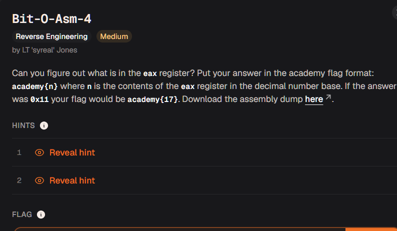

# bit o asm




and then he opened x64dbg, stepped 2 instructions forward, and then PASTED THE EAX VALUE

what is this shit blud

oh in this case its not even a fucking binary lmao this is just a disasm dump

```asm
<+0>:     endbr64 
<+4>:     push   rbp
<+5>:     mov    rbp,rsp
<+8>:     mov    DWORD PTR [rbp-0x14],edi
<+11>:    mov    QWORD PTR [rbp-0x20],rsi
<+15>:    mov    DWORD PTR [rbp-0x4],0x9fe1a
<+22>:    cmp    DWORD PTR [rbp-0x4],0x2710
<+29>:    jle    0x55555555514e <main+37>
<+31>:    sub    DWORD PTR [rbp-0x4],0x65
<+35>:    jmp    0x555555555152 <main+41>
<+37>:    add    DWORD PTR [rbp-0x4],0x65
<+41>:    mov    eax,DWORD PTR [rbp-0x4]
<+44>:    pop    rbp
<+45>:    ret

```

average of what it looks like from gdb btw

right so basically lets go through the steps of what this assembly means

push rbp, mov rbp rsp -> MOST USUALLY most probably and highly likely - this is the start of a function because generally when you set th ebase pointer its going to be the point where your function args start coming in

+8 -> putting something at rbp-20 address, a double word which is 4 bytes
+11 -> putting rbp-32 address, a quad word which is like 8 bytes
+15 -> putting rbp-4 address, a double word, we're putting a constant value which is 654874
+22 -> comparing [rbp-4] and 10000

what this jle means is basically just jump less equal, so in this case our first value is bigger than the other which also satisfies what our hint says which is that we dont need knowledge jmp/cmp statement relationships to solve this challenge

+31 -> subtract 101 from 654874 = 654773

+35 -> jump straight to +41 no questions asked

+41 -> mov the damn value into eax


and thats the flag

academy{654773}

easy as fuck

hard as fuck to crack denuvo though
