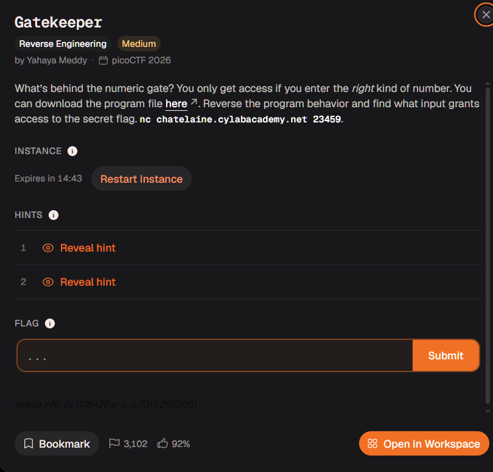
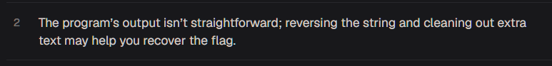

# gatekeeper




simple number extraction

```bash
shaurya_pratap@cheeese:flag folder$ nc chatelaine.cylabacademy.net 23459
Enter a numeric code (must be > 999 ): 93024
Too high.

```
obviously


oh wait i gotta go install ghidra i forgot it left my computer when i cleared my downloads folder lmao

ill js drop the file in dogbolt.org in the meantime

```c

//----- (000000000000158E) ----------------------------------------------------
int __fastcall main(int argc, const char **argv, const char **envp)
{
  int v4; // [rsp+8h] [rbp-38h]
  int v5; // [rsp+Ch] [rbp-34h]
  char s[40]; // [rsp+10h] [rbp-30h] BYREF
  unsigned __int64 v7; // [rsp+38h] [rbp-8h]

  v7 = __readfsqword(0x28u);
  printf("Enter a numeric code (must be > 999 ): ");
  fflush(stdout);
  __isoc99_scanf("%31s", s);
  v5 = strlen(s);
  if ( (unsigned int)is_valid_decimal((__int64)s) != 0 )
  {
    v4 = atoi(s);
  }
  else
  {
    if ( (unsigned int)is_valid_hex((__int64)s) == 0 )
    {
      puts("Invalid input.");
      return 1;
    }
    v4 = strtol(s, nullptr, 16);
  }
  if ( v4 > 999 )
  {
    if ( v4 <= 9999 )
    {
      if ( v5 == 3 )
        reveal_flag();
      else
        puts("Access Denied.");
    }
    else
    {
      puts("Too high.");
    }
  }
  else
  {
    puts("Too small.");
  }
  return 0;
}
```

pretty easy to make sense of this code its just checking our input against some conditions


key points 

- scanf drops input into a 40 character variable 
- v4 is the variable which has the integer value of the number because atoi does that (its basic c)
- v5 is the variable which stores the length of the string
- conditions which be literally being tested are
- is number > 999 and at the same time number is <= 9999, and is the length of the string of the number 3 characters
- how the fuck do you get an integer thats more than 999 but also can occupy only 3 characters in a string?
- fuck if i know

- another branch condition i missed literally right now as im writing this at 4:30 am is that it also checks for hex values
- that means you can define the number as 0xfff and have the character length be equal to 3

```bash
gshaurya_pratap@cheeese:Downloads$ ./gatekeeper
Enter a numeric code (must be > 999 ): fff
Flag file not found.
```
oh this was locally

```bash
shaurya_pratap@cheeese:flag folder$ nc chatelaine.cylabacademy.net 23459
Enter a numeric code (must be > 999 ): fff
Access granted: }94fftc_oc_ipdf06ftc_oc_ip0_99ftc_oc_ip9_TGftc_oc_ip_xehftc_oc_ip_tigftc_oc_ipid_3ftc_oc_ip{ymeftc_oc_ipdacaftc_oc_ip
```

typa shit i be writing in evs exam



oh thanks hint i love u

```
pi_co_ctfacadpi_co_ctfemy{pi_co_ctf3_dipi_co_ctfgit_pi_co_ctfhex_pi_co_ctfGT_9pi_co_ctf99_0pi_co_ctf60fdpi_co_ctff49}
```
still dont know what the hell this is but im guessing its to remove the pi_co_ctf part frmo this hey thats a pretty good guess

flag = academy{3_digit_hex_GT_999_060fdf49}

pretty ez


oh cool my ghidra finished downloading lmao