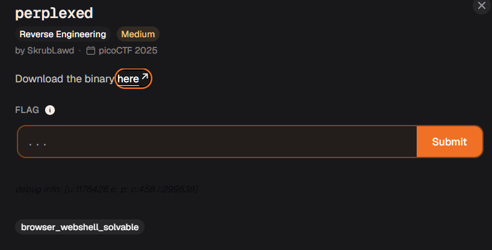

# perplexed



this is a browser webshell?

the fuck?

i thought this was reversing

```
shaurya_pratap@cheeese:Downloads$ ./perplexed
Enter the password: dsajflksdajflksajfkasf
Wrong :(
```

relatively simple its time to ghidra this stuff

alright i mapped the entry point lets see whats going on

```c
...
  printf("Enter the password: ");
  fgets(local_118,0x100,stdin);
  local_c = check(local_118);
  bVar1 = local_c != 1;
  if (bVar1) {
    puts("Correct!! :D");
  }
  else {
    puts("Wrong :(");
  }
  return !bVar1;
}
```

alright so this is where we discover that we're taking 256 bytes from the user

we're doing a check function so we need to go check what it's doing, hopefully no rotatory shift brute for mindfk

```


```c
undefined8 check(char *param_1)

{
  size_t sVar1;
  undefined8 uVar2;
  size_t sVar3;
  char local_58 [36];
  uint local_34;
  uint local_30;
  undefined4 local_2c;
  int local_28;
  uint local_24;
  int local_20;
  int local_1c;
  
  sVar1 = strlen(param_1);
  if (sVar1 == 0x1b) {
    local_58[0] = -0x3d;
    local_58[1] = -0x71;
    local_58[2] = '\x0e';
    local_58[3] = 'L';
    local_58[4] = -0x45;
    local_58[5] = '|';
    local_58[6] = -5;
    local_58[7] = 'a';
    local_58[8] = -0x47;
    local_58[9] = -99;
    local_58[10] = -4;
    local_58[0xb] = 'Z';
    local_58[0xc] = '[';
    local_58[0xd] = -0x21;
    local_58[0xe] = 'i';
    local_58[0xf] = 0xd2;
    local_58[0x10] = -2;
    local_58[0x11] = '\x1b';
    local_58[0x12] = -0x13;
    local_58[0x13] = -0xc;
    local_58[0x14] = -0x13;
    local_58[0x15] = 'g';
    local_58[0x16] = -0xc;
    local_1c = 0;
    local_20 = 0;
    local_2c = 0;
    for (local_24 = 0; local_24 < 0x17; local_24 = local_24 + 1) {
      for (local_28 = 0; local_28 < 8; local_28 = local_28 + 1) {
        if (local_20 == 0) {
          local_20 = 1;
        }
        local_30 = 1 << (7U - (char)local_28 & 0x1f);
        local_34 = 1 << (7U - (char)local_20 & 0x1f);
        if (0 < (int)((int)param_1[local_1c] & local_34) !=
            0 < (int)((int)local_58[(int)local_24] & local_30)) {
          return 1;
        }
        local_20 = local_20 + 1;
        if (local_20 == 8) {
          local_20 = 0;
          local_1c = local_1c + 1;
        }
        sVar3 = (size_t)local_1c;
        sVar1 = strlen(param_1);
        if (sVar3 == sVar1) {
          return 0;
        }
      }
    }
    uVar2 = 0;
  }
  else {
    uVar2 = 1;
  }
  return uVar2;
}

```

something is very wrong


alright lets do a little bit of renaming variables here lets make this readable

```c
#include <string.h>

typedef unsigned int uint;
typedef unsigned long long undefined8;

undefined8 check(char *param_1)
{
  size_t length = strlen(param_1);
  if (length != 0x1b) {
      return 1;
  }

  char comparison[36] = {
      0xC3, 0x8F, 0x0E, 'L',  0xBB, '|',  0xFB, 'a', 
      0xB9, -99,  0xFC, 'Z',  '[',  0xDF, 'i',  0xD2, 
      0xFE, 0x1B, 0xED, 0xF4, 0xED, 'g',  0xF4
  };

  int counter = 0;
  int k = 0;

  for (i = 0; i < 23; i = i + 1) {


    for (j = 0; j < 8; j = j + 1) {
      if (k == 0) {
        k = 1;
      }
      // actually if you made a good observation you can see that
      // j = 0 1 2 3 4 5 6 7 
      // k = 1 2 3 4 5 6 7 0
      // high iq move

      uint shifted_j = 1 << (7U - (char)j & 31); // wtf are these
      uint shifted_k = 1 << (7U - (char)k & 31);
      
      if ((0 < ((int)param_1[counter] & shifted_k)) != (0 < ((int)comparison[i] & shifted_j))) {
        return 1;
      }
      
      k++;
      if (k == 8) {
        k = 0;
        counter++;
      }
      
      if ((size_t)counter == length) {
        return 0;
      }
    }
  }
  return 0;
}

```


ok so 

```c
uint shifted_j = 1 << (7U - (char)j & 31);
uint shifted_k = 1 << (7U - (char)k & 31);
```

wtf is this?


running this in python we can see what exactly happens to numbers when this is ran

```py

>>> 1 << (7 - 1 & 31 )
64
>>> bin(64)
'0b1000000'
>>> 1 << (7 - 2 & 31 )
32
>>> bin(64)
'0b1000000'
>>> bin(2)
'0b10'
>>> 1 << (7 - 4 & 31 )
8
>>> bin(8)
'0b1000'
>>> 1 << (7 - 3 & 31 )
16
>>> 1 << (7 - 5 & 31 )
4
>>> 1 << (7 - 7 & 31 )
1
>>> 
```

highly intuitive if you keep replacing j or k with more values you see that you're placing 1 on the certain position but from the left instead of the right

so for example if j = 1, the expression is 64, j = 2, expression is 32 etc.etc.

j = 0
bin   10000000
j = 1

bin - 01000000

j = 2

bin - 00100000

j = 3

bin - 00010000


alright where to go from here???


(0 < ((int)param_1[counter] & shifted_k)) this is a proper bitmask

so it isolates whether that k-th bit is on or off

IF BOTH the bits of at shifted_k and shifted_j aren't on at the same time, then check quits with a falsey value


what is the overall loop doing??

basically k is +1 of j each iteration and for each character in comparison[] it's checking if each character is cyclically +1'd by its bits compared to what we entered.
 (in a nutshell) im sleep deprived so dont judge me

and we can make sure its cyclical because of the comment i left here

```c
// actually if you made a good observation you can see that
// j = 0 1 2 3 4 5 6 7 
// k = 1 2 3 4 5 6 7 0
// high iq move
```

so the simplest best way to solve this is to just cyclically shift all the characters by their bits in comparison[]

thats it thats the whole thing


```py


comparison = [
    -0x3d, -0x71, 0x0e, ord('L'), -0x45, ord('|'), -5, ord('a'),
    -0x47, -99, -4, ord('Z'), ord('['), -0x21, ord('i'), 0xd2,
    -2, 0x1b, -0x13, -0xc, -0x13, ord('g'), -0xc
]
comparison = [b & 0xFF for b in comparison]


param_1_bits = [0] * (27 * 8)

k = 0
counter = 0

for i in range(23):
    for j in range(8):
        if k == 0:
            k = 1
        
        comp_bit = (comparison[i] >> (7 - j)) & 1
        
        param_1_bits[counter * 8 + k] = comp_bit
        
        k += 1
        if k == 8:
            k = 0
            counter += 1
        if counter == 27:
            break
    if counter == 27:
        break


flag_bytes = []
for i in range(27):
    b = 0
    for bit in param_1_bits[i*8 : (i+1)*8]:
        b = (b << 1) | bit
    flag_bytes.append(b)

flag = bytes(flag_bytes).decode('utf-8').strip('\x00')
print(f"Decoded Flag: {flag}")

# academy{0n3_bi7_4t_a_7im3}

```

