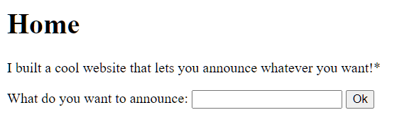
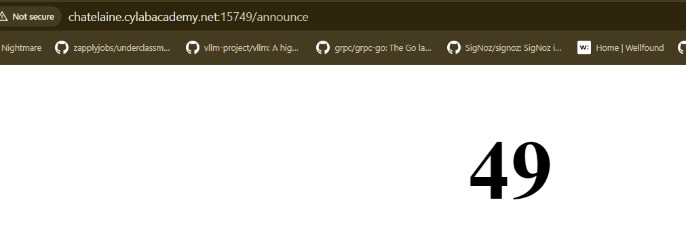
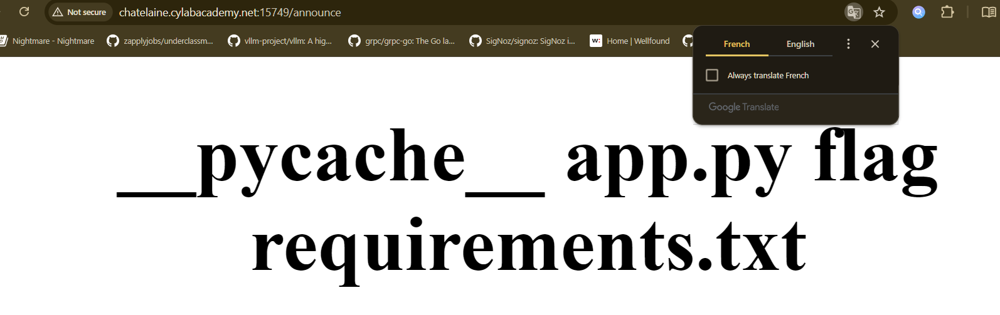
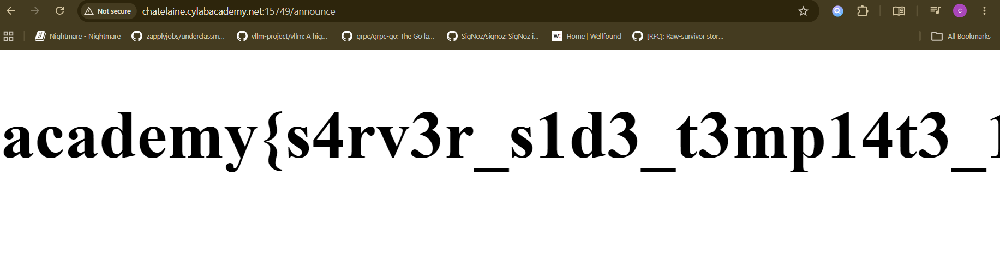

# SSTI

whats up gamers first challenge of the decade huh?

# how 2 do web exploitation

so i've started an instance at - `chatelaine.cylabacademy.net:15749`

the site in general looks like this - 



i could've made a better site with html ALONE in 5th grade

anyways that aside what's blatantly apparent is this

key points
- the site expects us to input something so it can say it back. now if i was a beginner i'd be a little confused, but this is generally a textbook SSTI vulnerability. 

how do i know it's SSTI? fuck if i know. because I used to host purely development mode servers in flask. when you're working with flask and serving webpages there's special syntax you can use to represent stuff from the webserver. when you're in development mode that falls hella vulnerable.

also i once participated in a cool ctf organized by gd goenka back when i was in 9th grade where i spent most of my time figuring out which was the correct Jinja2 ssti payload. you do usually need the code for the webserver sometimes. i'm not a structured learner i usually learn on the spot lmao.


as you can see - 

when you enter `{{7*7}}`




so this means we can execute stuff, this is like taking candy from a baby so lets quickly browse the files in the directory - 

```py
{{config.__class__.__init__.__globals__['os'].popen('ls').read()}}
```
this just basically says do ls on what is presumably a linux machine (if its windows do dir)



ah yeah i do love french, anyways flag is there lets take it

```py
{{config.__class__.__init__.__globals__['os'].popen('cat flag').read()}}
```




usually i use my payloads from here - https://github.com/swisskyrepo/PayloadsAllTheThings/blob/master/Server%20Side%20Template%20Injection/Python.md#jinja2---basic-injection

I found this a couple years ago, lovely repo i still use it sometimes and sometimes SSTI can work on self hosted ctf sites whose maintainers forgot to turn dev off (oops).

# a little bit more about SSTI

ok so you're thinking "what a script kiddie, doesnt even know what python does i bet", let me tell you what the so called payload is actually doing

- basically config is actually a global variable that comes with every flask app in python generally, and you can touch it within the scope of the handler
- this one sensitive variable contains a ton of stuff about its own class mainly which is the Config class
- but the fact of the matter is that we can do a lil thing called `__globals__` now this just opens things WIDE, you can see barebones of the file this class was written in and see all the modules, variables etc. that were imported into it
- this brings to another thing - THE MORE DEPENDENCIES YOU HAVE THE MORE TOOLS A HACKER HAS TO DESTROY YOUR APPLICATION
- this happens especially on .NET frameworks when someone leaves a dependency in that do incredibly dangerous stuff like edit or read files or have privileges
- this is why regular cleaning is important (go shower)
- so we abuse the open os module in the file to run function `.popen` which is opening a new process to run a command pretty standard way to run bash through python
- done
